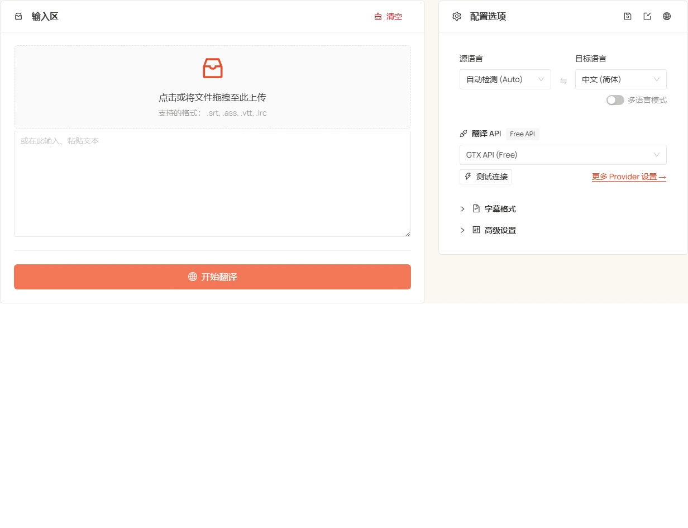

<h1 align="center">
⚡️ Subtitle Translator
</h1>
<p align="center">
    <a href="./README.md">English</a> | 中文
</p>
<p align="center">
    <em>AI 驱动的批量字幕翻译，支持 120+ 种语言，秒级完成</em>
</p>

<p align="center">
  <a href="LICENSE"></a>
  <a href="https://tools.newzone.top/zh/subtitle-translator"></a>
</p>

**Subtitle Translator** 是一款免费、纯浏览器运行的批量字幕翻译工具，支持 `.srt`、`.ass`、`.vtt`、`.lrc` 等格式。通过分块压缩 + 并行处理，可达到 1 集电视剧 ≈ 1 秒的翻译速度。可一次性批量上传整季字幕，接入 7 种传统翻译 API（DeepL、Google、Azure、DeepLX、Qwen-MT、TranslateGemma、GTX）和 17+ 种 LLM，覆盖 120+ 种语言——还能一次翻译成多种目标语言，每种语言各导出为独立文件。全程在浏览器本地完成，字幕内容与 API Key 不经过服务器。

👉 **在线体验**：<https://tools.newzone.top/zh/subtitle-translator>



## 核心特性

- **秒级翻译**：分块压缩 + 并行处理，达到 1 秒翻译一集电视剧（GTX 接口稍慢）。
- **批量处理**：一次性拖入上百份字幕文件（整季剧集一次搞定），每个文件独立翻译、以原文件名自动下载，结束时汇总成功 / 失败统计（如"已导出 (3/5)"）。
- **多语言输出**：一次可翻译成多种目标语言——每种语言各导出为独立文件，并自动追加语言代码（如 `movie.zh.srt`、`movie.fr.srt`）。
- **格式兼容**：自动识别 `.srt`、`.ass`、`.vtt`、`.lrc`。WebVTT 的 NOTE / STYLE / REGION 非 cue 块会被正确跳过（不当作对白翻译）。翻译过程中支持一键格式互转（SRT ↔ VTT、SRT/VTT → ASS）。
- **双语字幕**：译文可插入原字幕上方或下方，对齐保留。SRT / VTT 源还可导出 **ASS**，原文与译文分别走 Default / Secondary 样式（默认 70pt 白色 + 55pt 青色），可在字幕编辑器里独立调整。
- **上下文关联翻译**（仅 LLM）：每批携带前后文，对话更连贯，角色语气更稳定。
- **结构化分离**：时间轴、序号、ASS 头、VTT cue id 在本地剥离，只把对白文本发给引擎，模型无法弄乱时间轴。
- **字幕提取**：剥离 cue / 时间码，导出纯文本（自动复制到剪贴板）用于 AI 总结、剧本回填或二次创作。
- **无上限缓存**（IndexedDB）：所有翻译结果本地缓存，无浏览器存储容量限制，刷新页面已译文件不丢失。
- **120+ 种语言**：支持 120+ 种语言互译，源语言默认 Auto 自动检测。
- **多语言界面**：基于 next-intl，支持 18 种界面语言。
- **隐私优先**：完全前端处理——字幕内容与 API Key 仅保存在浏览器；LLM 请求直接从浏览器发往你配置的 API 端点。

## 翻译接口

支持 **7 种传统翻译 API** 和 **17+ 种 LLM 服务**：

### 传统翻译 API

| API 类型             | 翻译质量 | 稳定性 | 免费额度                        |
| -------------------- | -------- | ------ | ------------------------------- |
| **DeepL**            | ★★★★★    | ★★★★☆  | 每月 50 万字符                  |
| **Google Translate** | ★★★★☆    | ★★★★★  | 每月 50 万字符                  |
| **Azure Translate**  | ★★★★☆    | ★★★★★  | **前 12 个月** 每月 200 万字符  |
| **DeepLX（免费）**   | ★★★★☆    | ★★★☆☆  | 自部署或公共免费节点            |
| **Qwen-MT**          | ★★★★☆    | ★★★★☆  | 阿里云百炼（DashScope）配额     |
| **TranslateGemma**   | ★★★★☆    | ★★★★☆  | 自部署（LM Studio / Ollama 等） |
| **GTX API（免费）**  | ★★★☆☆    | ★★★☆☆  | 免费（有频率限制）              |

### AI 大模型

支持 **DeepSeek**、**OpenAI**、**Claude**、**Gemini**、**Qwen**、**Moonshot**、**Doubao**、**Zhipu GLM**、**MiniMax**、**Mistral**、**Perplexity**、**Cohere**、**OpenRouter**、**Groq**、**SiliconFlow**、**Nvidia NIM**、**Azure OpenAI**，以及任意 **Custom (OpenAI-compatible)** 端点（Ollama / LM Studio / vLLM / Together AI / Fireworks AI 等）。

LLM 模式提供：

- **适用场景**：文学作品、技术演讲、多语言对话
- **可定制**：支持配置 system / user prompt，定制翻译风格
- **温度控制**：调节 AI 创造性（0–1）
- **思考模式**：对推理类模型，可按 provider 单独开关

## 上下文关联翻译（仅 LLM）

LLM 模式可在每一批请求里携带前后文，提升对话连贯性和角色语气一致性。

- **并发行数**：同时翻译的最大行数（默认 20）。过高可能触发速率限制。
- **上下文行数**：每批携带的上下文行数（默认 50）。值越大连贯性越好，但 token 消耗也越多。

⚠️ **提示**：70B 以下或本地小模型容易输出错位文本，上下文模式建议使用主流在线大模型（Claude、GPT、DeepSeek、Gemini 等）。

## 字幕格式支持

| 格式     | 自动识别 | 双语 | 备注                                                                |
| -------- | -------- | ---- | ------------------------------------------------------------------- |
| **.srt** | ✅       | ✅   | 1–3 位毫秒、100+ 小时时间戳                                         |
| **.ass** | ✅       | ✅   | 行首位置标签（如 `\an8`）翻译后自动还原；复杂内联特效标签会被简化       |
| **.vtt** | ✅       | ✅   | NOTE / STYLE / REGION 块正确跳过；VTT→SRT 自动处理 `<c.classname>` 与卡拉 OK 时间戳 |
| **.lrc** | ✅       | ✅   | 正确处理多时间标签的卡拉 OK 行                                      |

- **自动编码检测**：jschardet 自动识别 UTF-8 / UTF-16 / GBK / Shift-JIS，避免乱码（识别失败回退 UTF-8）。
- **文件名保留**：导出文件继承原文件名，多语言输出额外追加语言代码后缀。
- **格式转换**：翻译过程中即可完成 SRT ↔ VTT、SRT/VTT → ASS 互转，无需单独转换器（源语言与目标语言相同会被禁止，故转换需绑定一次实际翻译）。

## 翻译模式

- **批量模式**（默认）：一次性拖入上百文件（整季剧集），每个文件独立翻译并自动下载，结束时汇总成功 / 失败统计。
- **单文件模式**：快速预览，新上传的文件替换当前文件。

## 常见问题

**支持哪些格式？** SRT、ASS、VTT、LRC。SRT/VTT 适配 YouTube、B 站、HTML5 播放器；ASS 适配 Aegisub 与动漫字幕组（行首位置标签如 `\an8` 自动还原）；LRC 适配音乐歌词。

**用机器翻译还是 AI 大模型？** 机器翻译（Google、DeepL、Azure、Qwen-MT）便宜或免费但对白语感平庸；大模型按 token 计费但译文明显更自然——性价比首选 DeepSeek（整季大批量适用），口语化质量首选 Claude Sonnet / GPT，超长字幕用 Gemini 的大上下文。

**人名、专有名词怎么保持一致？** 在任意大模型引擎的「系统提示词」里写一份术语保留表（如「保持原文：iPhone、OpenAI、John Smith」），整季共享同一上下文，全季译名一致。

**要加「保留时间轴 / 序号」之类的提示词吗？** 不需要。时间轴、序号、头信息都在本地剥离、译完回填，模型从头到尾看不到，提示词只写翻译风格、术语表与语气即可。

**隐私安全吗？** 安全。全程前端运行：字幕解析、翻译请求、缓存都在浏览器内完成；API Key 仅保存在本地浏览器，LLM 请求直接从浏览器发往你配置的端点。

更多说明见 [官方文档完整 FAQ](https://docs.newzone.top/guide/translation/subtitle-translator/)。

## 技术栈

- **框架**：[Next.js 16](https://nextjs.org/)（App Router）+ React 19 with React Compiler
- **UI**：[Ant Design 6](https://ant.design/) + [Tailwind CSS 4](https://tailwindcss.com/)
- **i18n**：[next-intl](https://next-intl-docs.vercel.app/)
- **缓存**：[idb](https://github.com/jakearchibald/idb)（IndexedDB）
- **编码检测**：[jschardet](https://github.com/aadsm/jschardet)

## 快速开始

### 环境要求

- Node.js >= 20.9.0
- Yarn（推荐）、npm 或 pnpm

### 安装与启动

```bash
git clone https://github.com/rockbenben/subtitle-translator.git
cd subtitle-translator

yarn install
yarn dev
```

打开 [http://localhost:3000](http://localhost:3000) 即可使用。

### 构建生产版本

```bash
yarn build
```

## 文档与部署

详细配置、API 设置和自托管说明，请参阅 **[官方文档](https://docs.newzone.top/guide/translation/subtitle-translator/)**。

**快速部署**：[部署指南](https://docs.newzone.top/guide/translation/subtitle-translator/deploy.html)

## 参与贡献

欢迎通过 Issue 或 Pull Request 参与贡献！

1. Fork 本仓库并创建功能分支
2. 本地执行 `yarn` 与 `yarn dev`
3. 适当补充测试 / 文档
4. 提交 PR 并清晰描述变更

## 许可协议

MIT © 2025 [rockbenben](https://github.com/rockbenben)。详见 [LICENSE](./LICENSE)。
