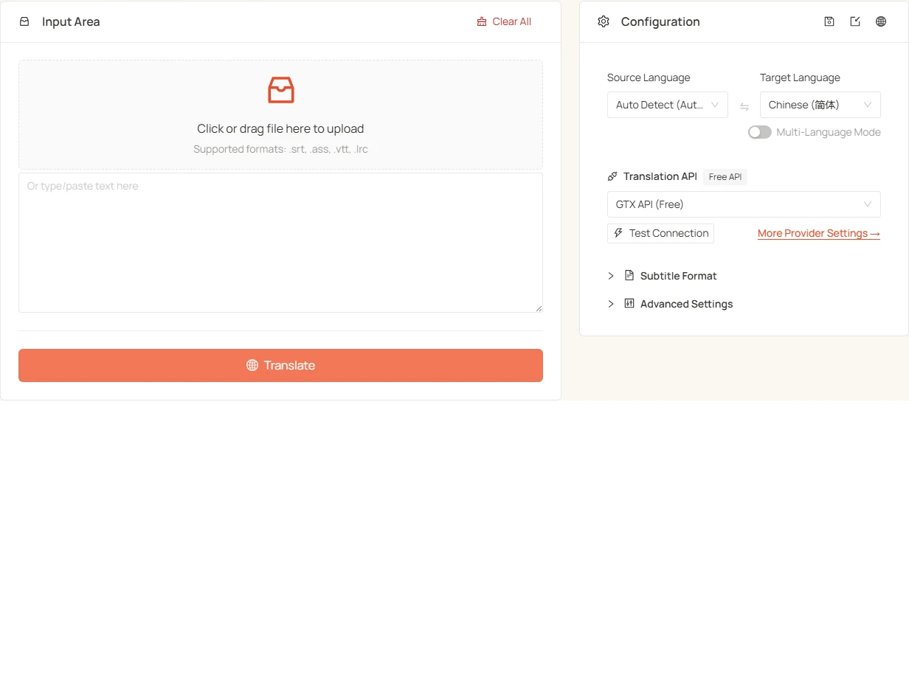

<h1 align="center">
⚡️ Subtitle Translator
</h1>
<p align="center">
    English | <a href="./README-zh.md">中文</a>
</p>
<p align="center">
    <em>Blazing-fast batch subtitle translation for 120+ languages — powered by AI</em>
</p>

<p align="center">
  <a href="LICENSE"></a>
  <a href="https://tools.newzone.top/en/subtitle-translator"></a>
</p>

**Subtitle Translator** is a free, browser-based batch subtitle translation tool for `.srt`, `.ass`, `.vtt`, and `.lrc` files. With chunked compression and parallel processing it hits ~1 second per episode. Batch-upload a whole season at once, connect to 7 traditional translation APIs (DeepL, Google, Azure, DeepLX, Qwen-MT, TranslateGemma, GTX) or 17+ LLM providers, and translate into 120+ languages — or into several target languages in a single pass, each exported as its own file. Everything runs locally in your browser; subtitle content and API keys never touch a server.

👉 **Try it online**: <https://tools.newzone.top/en/subtitle-translator>



## Key Features

- **Real-Time Translation**: Chunked compression + parallel processing → ~1 second per episode (GTX is slightly slower).
- **Batch Processing**: Drop hundreds of subtitle files at once (a whole season in one go); each file translates and downloads independently with its original filename, and you get an aggregated success/failure summary (e.g. "Exported (3/5)") when the run finishes.
- **Multi-Language Output**: Translate into multiple target languages in a single pass — each language is exported as its own file with the language code appended (e.g. `movie.zh.srt`, `movie.fr.srt`).
- **Format Compatibility**: Auto-detects `.srt`, `.ass`, `.vtt`, and `.lrc`. WebVTT NOTE / STYLE / REGION non-cue blocks are correctly skipped (not translated as dialogue). One-click format conversion (SRT ↔ VTT, SRT/VTT → ASS) during translation.
- **Bilingual Output**: Insert the translation above or below the original; alignment preserved across formats. For SRT / VTT sources you can also export **ASS** with separate styles for original and translation (Default 70pt white + Secondary 55pt cyan), tweakable in any subtitle editor.
- **Context-Aware Translation** (LLM only): Sends surrounding lines as context for more coherent dialogue and consistent character voice.
- **Structural Separation**: Timecodes, cue numbers, ASS headers, and VTT cue IDs are extracted locally — only dialogue text is sent to the engine, so the model can never disrupt your timeline.
- **Subtitle Extraction**: Strip cues / timing and export clean text (auto-copied to clipboard) for AI summarization, scripts, or content repurposing.
- **Unlimited Caching** (IndexedDB): All translations cached locally with no browser-storage size limit; refreshing the page doesn't lose translated files.
- **120+ Languages**: Translate to/from 120+ languages, with source defaulting to Auto-detect.
- **Multi-Locale UI**: Powered by next-intl, with full UI translation across 18 languages.
- **Private by Design**: Fully client-side — subtitle content and API keys stay in your browser; LLM requests go directly from your browser to the API endpoint you configure.

## Translation APIs

Supports **7 traditional MT APIs** and **17+ LLM providers**:

### Traditional APIs

| API                  | Quality | Stability | Free Tier                             |
| -------------------- | ------- | --------- | ------------------------------------- |
| **DeepL**            | ★★★★★   | ★★★★☆     | 500K chars/month                      |
| **Google Translate** | ★★★★☆   | ★★★★★     | 500K chars/month                      |
| **Azure Translate**  | ★★★★☆   | ★★★★★     | 2M chars/month (first 12 months)      |
| **DeepLX (Free)**    | ★★★★☆   | ★★★☆☆     | Self-host or free public endpoints    |
| **Qwen-MT**          | ★★★★☆   | ★★★★☆     | Alibaba DashScope quota               |
| **TranslateGemma**   | ★★★★☆   | ★★★★☆     | Self-host (LM Studio / Ollama / etc.) |
| **GTX API (Free)**   | ★★★☆☆   | ★★★☆☆     | Free (rate-limited)                   |

### LLM Providers

Supports **DeepSeek**, **OpenAI**, **Claude**, **Gemini**, **Qwen**, **Moonshot**, **Doubao**, **Zhipu GLM**, **MiniMax**, **Mistral**, **Perplexity**, **Cohere**, **OpenRouter**, **Groq**, **SiliconFlow**, **Nvidia NIM**, **Azure OpenAI**, plus any **Custom (OpenAI-compatible)** endpoint (Ollama / LM Studio / vLLM / Together AI / Fireworks AI etc.).

LLM modes give you:

- **Best for**: literary works, technical talks, multilingual dialogue
- **Customization**: configure system / user prompts for a specific translation style
- **Temperature Control**: adjust AI creativity (0–1 scale)
- **Thinking Mode**: per-provider toggle for reasoning-capable models

## Context-Aware Translation (LLM only)

LLM modes can send surrounding lines as context for each batch, improving dialogue coherence and character-voice consistency.

- **Concurrent Lines**: max lines translated in parallel (default 20). Too high triggers rate limits.
- **Context Lines**: lines included per batch as context (default 50). Higher = better coherence but more tokens.

⚠️ **Tip**: Models under 70B parameters may produce misaligned output. Mainstream online large models (Claude, GPT, DeepSeek, Gemini) are recommended for context mode.

## Subtitle Format Support

| Format   | Auto-detect | Bilingual | Notes                                                                        |
| -------- | ----------- | --------- | ---------------------------------------------------------------------------- |
| **.srt** | ✅          | ✅        | 1–3 digit milliseconds, 100+ hour timestamps                                 |
| **.ass** | ✅          | ✅        | Line-leading position tags (e.g. `\an8`) auto-restored; complex inline effect tags simplified |
| **.vtt** | ✅          | ✅        | NOTE / STYLE / REGION blocks correctly skipped; inline `<c.classname>` and karaoke timestamps handled on VTT→SRT |
| **.lrc** | ✅          | ✅        | Karaoke lines with multiple time tags handled correctly                      |

- **Automatic Encoding Detection**: jschardet auto-detects UTF-8 / UTF-16 / GBK / Shift-JIS, avoiding garbled output (falls back to UTF-8 if detection fails).
- **Filename Preservation**: Exported files inherit the original name; multi-language output appends a language code suffix.
- **Format Conversion**: Convert SRT ↔ VTT and SRT/VTT → ASS during translation — no separate converter needed (identical source/target languages are blocked, so conversion requires a translation pass).

## Translation Modes

- **Batch Mode (default)**: drop hundreds of files (a whole season) at once; each file translates independently and auto-downloads, with an aggregated success/failure summary.
- **Single-File Mode**: instant preview; uploading a new file replaces the current one.

## FAQ

**Which formats are supported?** SRT, ASS, VTT, and LRC. SRT/VTT suit YouTube and HTML5 players; ASS suits Aegisub / anime fansubs (position tags like `\an8` auto-restored); LRC suits music lyrics.

**Machine translation or LLM?** Machine translation (Google, DeepL, Azure, Qwen-MT) is cheap or free but reads flat. LLMs bill per token but produce far more natural dialogue — DeepSeek is the value pick for whole-season batches, Claude Sonnet / GPT give the most natural dialogue, and Gemini's large context handles book-length subtitles.

**How do I keep names and proper nouns consistent?** Add a glossary in the System Prompt (e.g. "Keep verbatim: iPhone, OpenAI, John Smith") on any LLM engine; all episodes share the same context, so terminology stays consistent across a season.

**Do I need "preserve timecodes / line numbers" prompts?** No. Timecodes, cue numbers, and headers are extracted locally and re-inserted after translation — the model never sees them. Keep your prompt focused on style, glossary, and tone.

**Is it private?** Yes. Everything runs client-side: subtitle parsing, translation requests, and caching all happen in your browser. API keys are stored only in local browser storage, and LLM requests go directly from your browser to your configured endpoint.

See the [full FAQ in the docs](https://docs.newzone.top/en/guide/translation/subtitle-translator/) for more.

## Tech Stack

- **Framework**: [Next.js 16](https://nextjs.org/) (App Router) + React 19 with the React Compiler
- **UI**: [Ant Design 6](https://ant.design/) + [Tailwind CSS 4](https://tailwindcss.com/)
- **i18n**: [next-intl](https://next-intl-docs.vercel.app/)
- **Caching**: [idb](https://github.com/jakearchibald/idb) (IndexedDB)
- **Encoding Detection**: [jschardet](https://github.com/aadsm/jschardet)

## Getting Started

### Requirements

- Node.js >= 20.9.0
- Yarn (recommended), npm, or pnpm

### Install & Run

```bash
git clone https://github.com/rockbenben/subtitle-translator.git
cd subtitle-translator

yarn install
yarn dev
```

Visit [http://localhost:3000](http://localhost:3000).

### Production Build

```bash
yarn build
```

## Documentation & Deployment

For detailed configuration, API setup, and self-hosting instructions, see the **[Official Documentation](https://docs.newzone.top/en/guide/translation/subtitle-translator/)**.

**Quick Deployment**: [Deploy Guide](https://docs.newzone.top/en/guide/translation/subtitle-translator/deploy.html)

## Contributing

Contributions are welcome! Feel free to open issues and pull requests.

1. Fork the repo and create a feature branch
2. Run `yarn` and `yarn dev` locally
3. Add tests / docs when applicable
4. Submit a PR with a clear description

## License

MIT © 2025 [rockbenben](https://github.com/rockbenben). See [LICENSE](./LICENSE).
